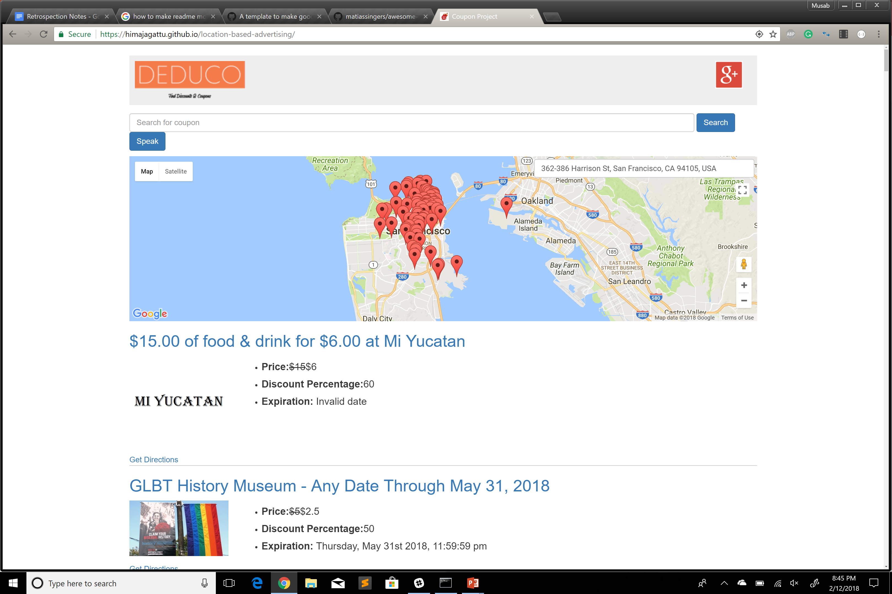

# couponProject

ProjectTitle: Location Based Advertising .

Technologies Used: HTML,CSS,BOOTSTRAP,JQUERY,AJAX/API, Below is google firebase code preview;
```javascript
		function googleSignin() {
		    firebase.auth()

		        .signInWithPopup(provider).then(function(result) {
		            var token = result.credential.accessToken;
		            var user = result.user;

		            var uid = user.uid;
		            database.ref('users').once('value', function(snapshot){
		              var users = snapshot.val() || {};
		              var userData = {
		                  token: token,
		                  user: {
		                    name: result.user.displayName,
		                    email: result.user.email,
		                    emailVerified: result.user.emailVerified,
		                    photoURL: result.user.photoURL,
		                    metadata: result.user.metadata
		                  }
		                };

		                users[uid] = userData;

		                database.ref('users').set(users);
		                setCookie(uid, token);
		                checkSession();
		            });

		            
		        }).catch(function(error) {
		            var errorCode = error.code;
		            var errorMessage = error.message;

		            
		        });
``````


	

Apis Used:GOOGLE PLACES,AUTO FILL ADDRESS,GOOGLE MARKER ,GOOGLE INFOWINDOW,SQOOT COUPONS APIS,GOOGLE SPEECH API

Description: The project is developed to find the near by deals available  based on the location.When user opens a site it detects user location and displays all the deals available in that location.By entering specific key user can find deals and store near by him.Voice search is also available in this website.User can see the directions to the store .Deals displays along with actual price ,discount price,houe much percentage user getting discount.

Website Preview: 



